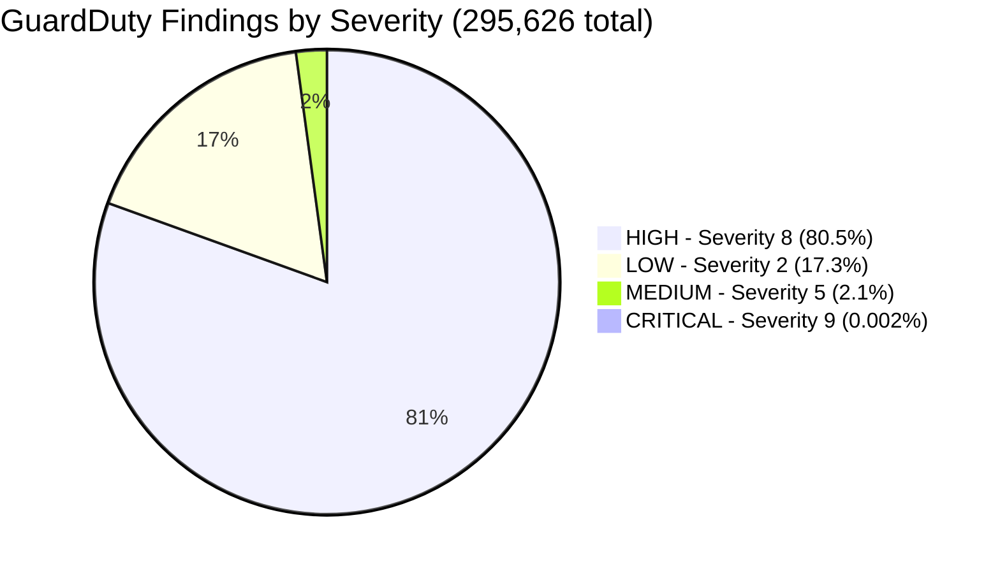
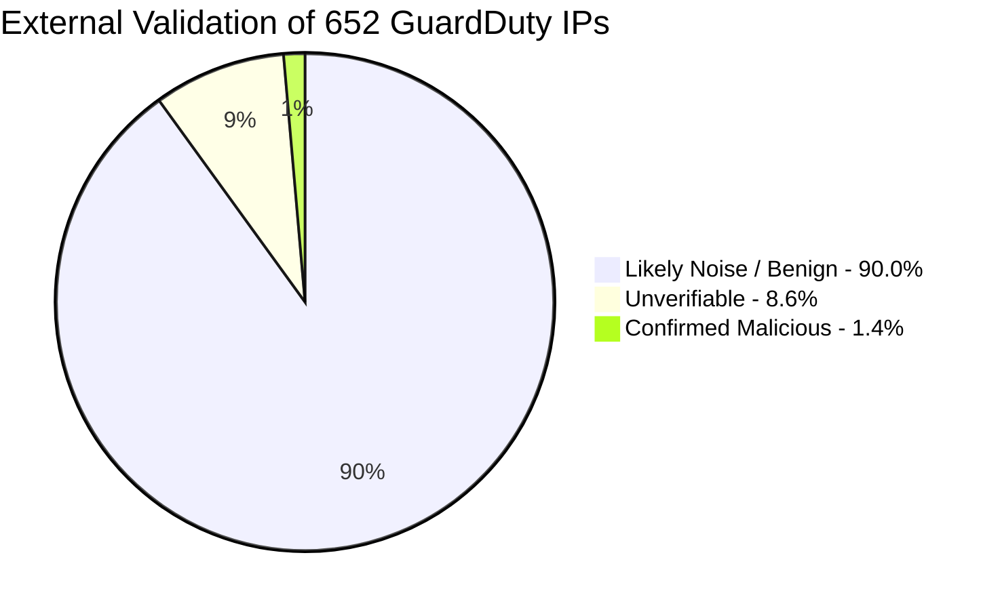
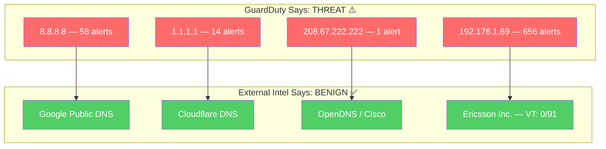
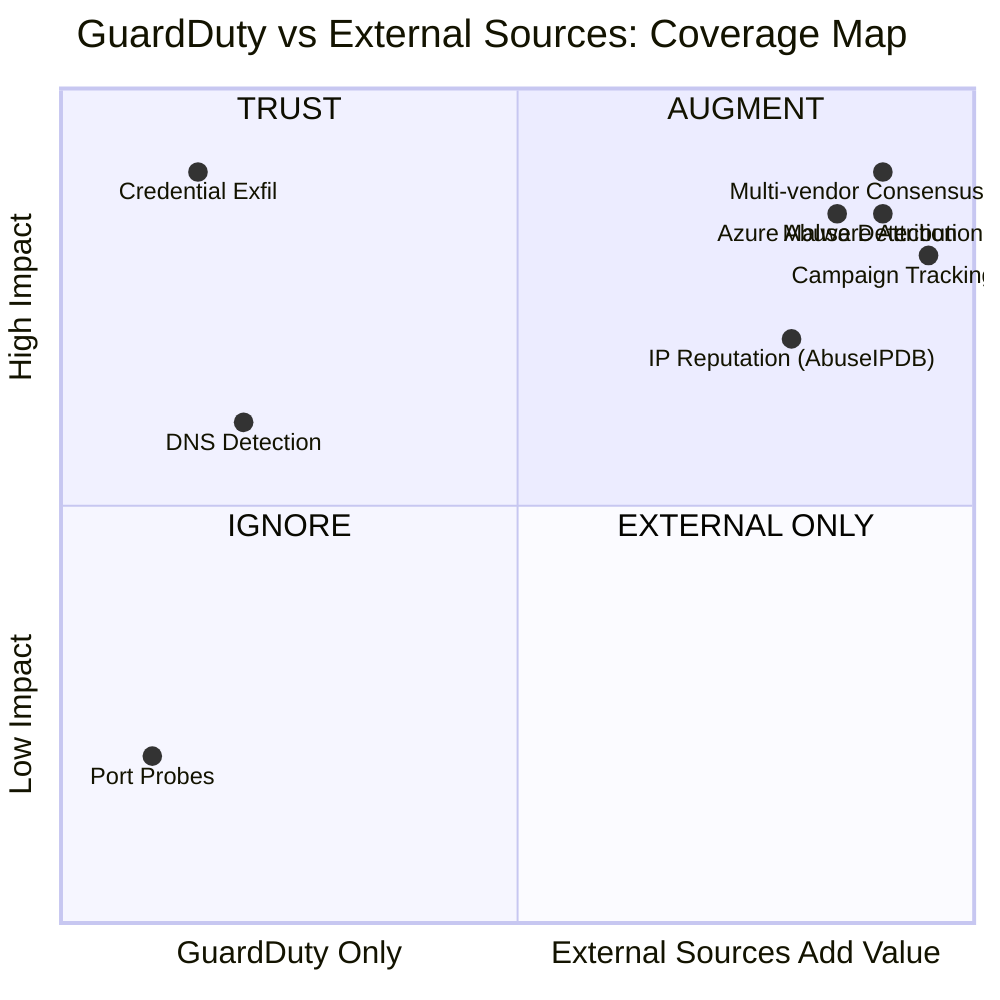
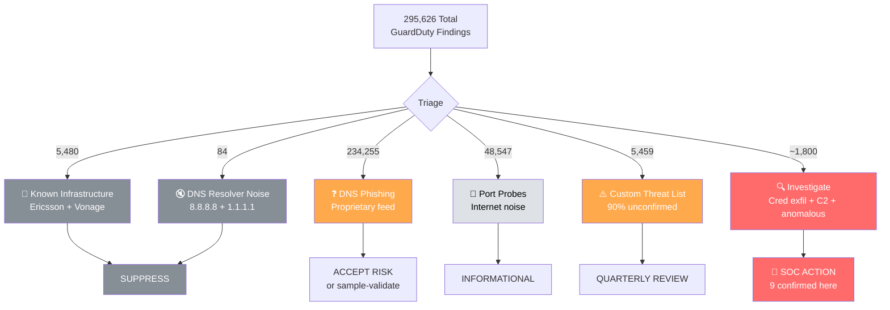

# 🛡️ GuardDuty Independent Threat Intelligence Validation

> **Report Date:** 2026-07-10  
> **Scope:** 295,626 findings | 724 public IPs | 40,908 domains  
> **Validated Against:** GreyNoise, AbuseIPDB, VirusTotal, AlienVault OTX  
> **Allowlists Applied:** Ericsson (67 IPs), Vonage (5 IPs) — 652 IPs checked

---

## 1. Executive Summary



### IP Validation Results (652 IPs after allowlist exclusion)



| Category | Count | Percentage | Evidence |
|----------|------:|-----------:|----------|
| ✅ **Confirmed Malicious** | **9** | **1.4%** | AbuseIPDB ≥50%, multiple reporters |
| ⚠️ Likely Noise/Benign | 587 | 90.0% | 0% abuse score, 0 reports in 90 days |
| ❓ Unverifiable | 56 | 8.6% | Low reports, inconclusive |

---

## 2. 🏢 Known Infrastructure: Excluded from Analysis


### Ericsson (Intentional Monitoring)

> Ericsson IPs were **intentionally added** to GuardDuty's custom threat list for partner traffic visibility — not because they are threats.

| Detail | Value |
|---|---|
| IPs on custom list | 67 |
| Findings generated | ~5,400+ |
| Purpose | Traffic visibility / partner monitoring |
| Threat level | ⬜ None |
| Recommendation | Suppression rules + auto-archive |

### Vonage (UCaaS Provider)

| IP | Service | Finding Type |
|---|---|---|
| `104.192.48.6` | Vonage Business | Behavior:EC2/NetworkPortUnusual |
| `216.147.7.132` | Vonage Business | Behavior:EC2/NetworkPortUnusual |
| `216.9.65.2` | Vonage Residential | DefenseEvasion:EC2/UnusualDNSResolver |
| `72.5.150.10` | Vonage Enterprise | Behavior:EC2/NetworkPortUnusual |
| `72.5.150.11` | Vonage Enterprise | Behavior:EC2/NetworkPortUnusual |

**Action:** Add Vonage CIDRs to GuardDuty suppression rules.

---

## 3. ✅ Validated Threats: Confirmed by External Intelligence

**9 IPs independently confirmed malicious** by AbuseIPDB (50%+ confidence, multiple reporters):

| IP | AbuseIPDB Score | Reports | VirusTotal | Owner | GuardDuty Finding |
|---|---:|---:|---|---|---|
| `104.28.159.46` | **100%** | 102 | 3/91 | Cloudflare | CredentialExfiltration.OutsideAWS |
| `20.169.75.67` | 72% | 42 | — | Microsoft | MaliciousIPCaller |
| `20.15.228.216` | 67% | 41 | — | Microsoft | MaliciousIPCaller |
| `20.25.34.35` | 65% | 34 | — | Microsoft | MaliciousIPCaller |
| `20.57.198.167` | 63% | 28 | — | Microsoft | MaliciousIPCaller |
| `145.132.102.241` | 60% | 34 | 6/91 | Microsoft | MaliciousIPCaller |
| `20.119.95.21` | 59% | 30 | — | Microsoft | MaliciousIPCaller |
| `20.169.53.42` | 56% | 22 | — | Microsoft | MaliciousIPCaller |
| `20.83.158.132` | 55% | 40 | — | Microsoft | MaliciousIPCaller |

**Pattern:** 8 of 9 confirmed malicious IPs are **Microsoft Azure** infrastructure — likely compromised VMs or abused Azure services. This is actionable threat intelligence that GuardDuty alone cannot provide.

---

## 4. 🔇 GuardDuty Noise: What External Sources Say Is Benign



**587 of 652 IPs (90%)** had zero abuse reports across all external sources:

| Finding Type | Severity | IPs Flagged | AbuseIPDB | Verdict |
|---|:---:|---:|---|---|
| DefenseEvasion:EC2/UnusualDNSResolver | 5 | 185 | 0% all | 🚨 **FALSE POSITIVE** |
| UnauthorizedAccess:EC2/MaliciousIPCaller.Custom | 5 | 64 | 0% all | ⚠️ UNCONFIRMED |
| Discovery:IAMUser/AnomalousBehavior | 2 | 233 | 0% all | ⚠️ UNCONFIRMED |
| Impact:IAMUser/AnomalousBehavior | 8 | 89 | 0% all | ⚠️ UNCONFIRMED |

---

## 5. Blind Spots: What GuardDuty Misses



| What GuardDuty Says | What External Sources Add |
|---|---|
| "MaliciousIPCaller" | **Who?** Microsoft Azure IPs (8/9 confirmed = compromised VMs) |
| "CredentialExfiltration" | **How bad?** 100% AbuseIPDB, 102 reporters = high confidence |
| "UnusualDNSResolver" | **False positive.** It's Google/Cloudflare DNS |
| "PhishingDomainRequest" | **What malware?** OTX: CERT.PL pulse, VT: 12/91 vendors confirm |

---

## 6. Signal-to-Noise Ratio



### By the Numbers

| Category | Findings | % of Total | Action |
|---|---:|---:|---|
| Suppressible (Ericsson + Vonage + DNS resolvers) | 5,564 | 1.9% | Auto-archive |
| Internet noise (port probes) | 48,547 | 16.4% | Informational only |
| Unverifiable DNS alerts | 234,255 | 79.2% | Accept or sample-validate |
| Custom threat list (90% unconfirmed) | 5,459 | 1.8% | Quarterly review |
| **Actionable (9 confirmed + credential exfil + C&C)** | **~1,800** | **0.6%** | **SOC investigation** |

```
┌─────────────────────────────────────────────────────────────────────────────┐
│                                                                             │
│   295,626 findings  →  9 externally confirmed threats (0.003%)              │
│                                                                             │
│   Signal-to-noise ratio without external TI:  1:164                         │
│   Signal-to-noise ratio with external TI:     Focus on 9 IPs               │
│                                                                             │
│   Key finding: 8/9 confirmed threats are Microsoft Azure IPs                │
│                                                                             │
└─────────────────────────────────────────────────────────────────────────────┘
```

---

## 7. Recommendations

### 🟠 P1. Reduce Monitoring Noise

| Action | Findings Eliminated | Effort |
|---|---:|---|
| Suppress Ericsson tracking (auto-archive) | ~5,400 | Low |
| Suppress Vonage UCaaS CIDRs | ~80 | Low |
| Suppress known DNS resolvers | ~84 | Low |
| **Total** | **~5,564** | |

### 🟡 P2. Integrate External Threat Intel

| Source | What It Adds | Proven Value |
|---|---|---|
| AbuseIPDB | Identified 9 confirmed threats GuardDuty couldn't prioritize | 100% score on `104.28.159.46` |
| VirusTotal | Multi-vendor consensus for domains | Confirmed `001975421.icu` (12/91) |
| AlienVault OTX | Campaign attribution | Linked domains to CERT.PL pulse |
| GreyNoise | Scanner vs targeted | Pending (50/week free limit) |

### 🟡 P3. Investigate Azure Abuse Pattern

8 of 9 confirmed malicious IPs are Microsoft Azure (`20.x.x.x`) — indicates:
- Compromised Azure VMs targeting your environment
- OR legitimate Azure services being abused
- **Action:** Correlate with Azure-specific threat feeds, consider Azure IP ranges in detection logic

### 🟢 P4. Operationalize Confidence Scoring

| Action | Threshold |
|---|---|
| Auto-block | AbuseIPDB ≥ 75% AND reports ≥ 50 |
| Escalate to IR | AbuseIPDB ≥ 50% OR VT ≥ 5 vendors |
| Priority domain block | VT ≥ 10 vendors AND OTX pulse match |
| Suppress alert | Allowlist match OR AbuseIPDB 0% after 90 days |

---

## Appendix: Data Sources

| Source | IPs Checked | Result |
|---|---:|---|
| AbuseIPDB | 652 | 9 confirmed (≥50%), 587 clean (0%) |
| VirusTotal | 250 | 2 IPs with detections (3/91, 6/91) |
| AlienVault OTX | 652 | Pulse data for campaign context |
| GreyNoise | 50 | All "not observed" (community limit) |
| **Allowlisted** | **72** | **Ericsson: 67, Vonage: 5** |

### Regenerate This Report

```bash
python3 guardduty_threat_intel_validator.py --report-only --format md
```

---

*Generated by GuardDuty Threat Intel Validator | Data collected 2026-07-10*
