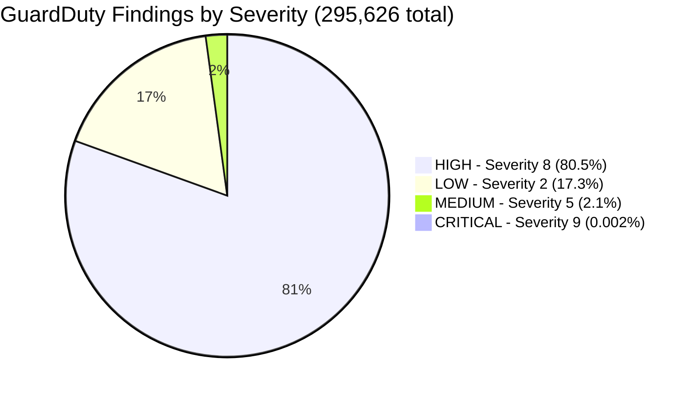
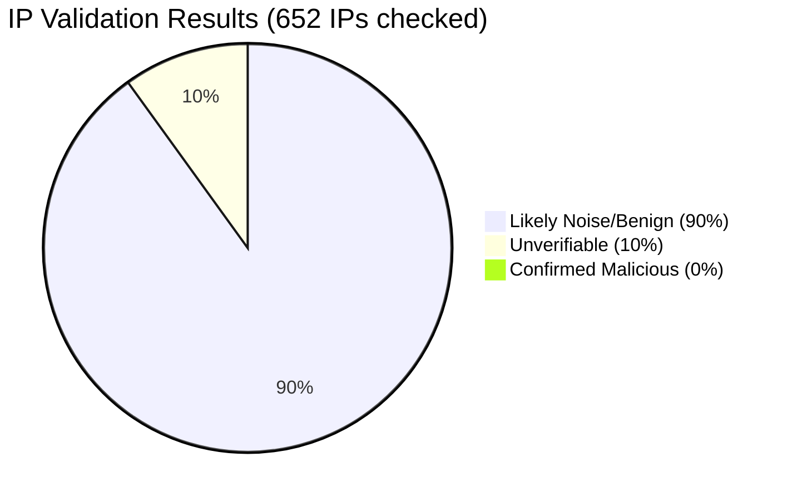
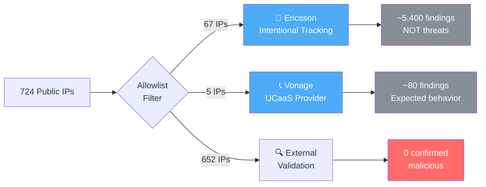
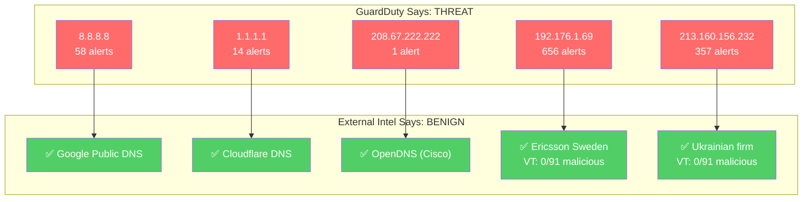
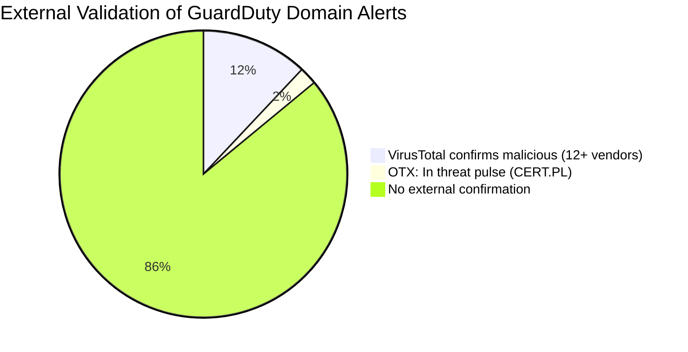
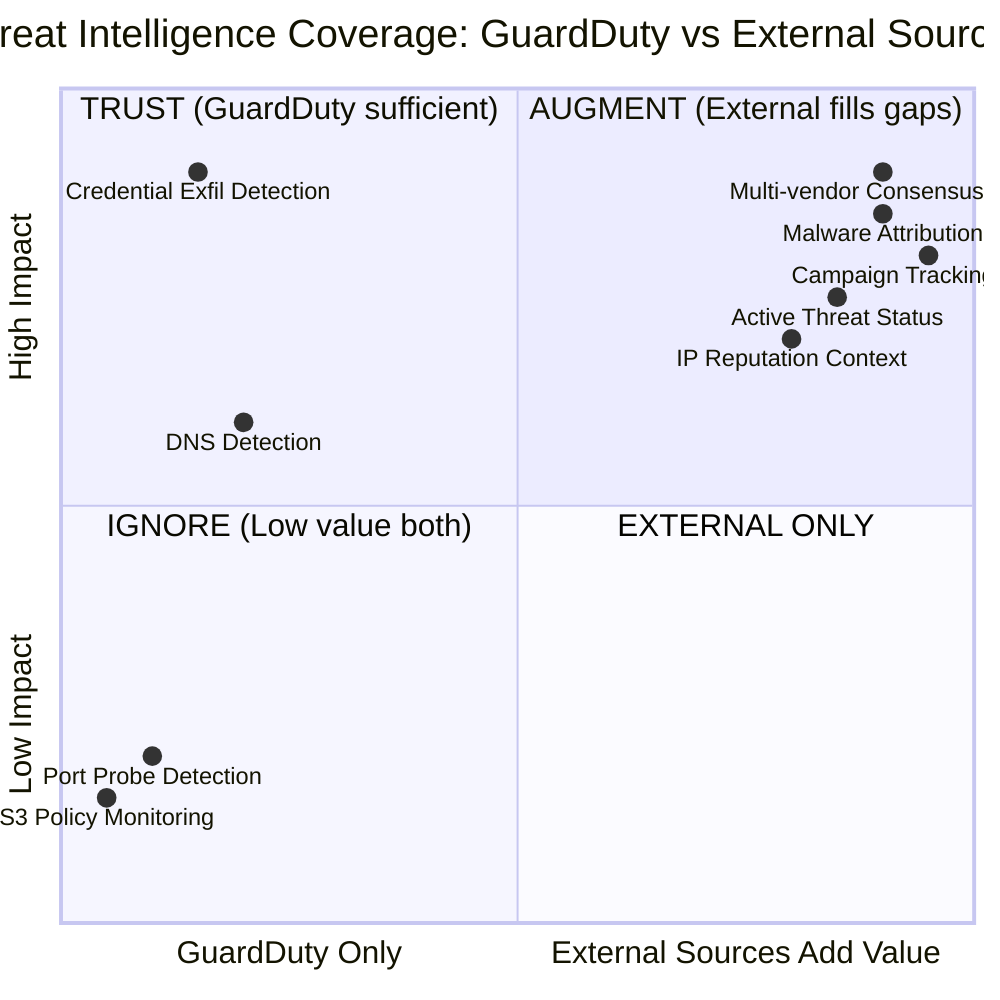
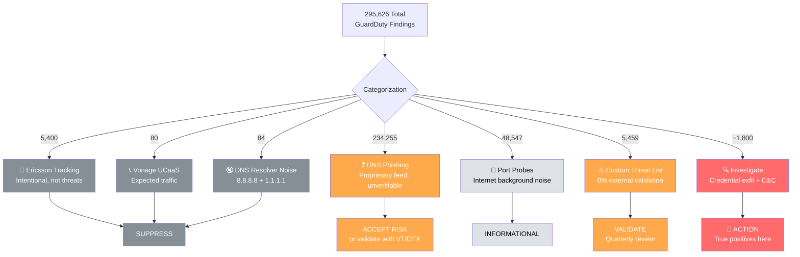

# 🛡️ GuardDuty Independent Threat Intelligence Validation

> **Report Date:** 2026-07-10  
> **Scope:** 295,626 findings | 724 public IPs | 40,908 domains  
> **Validated Against:** GreyNoise, AbuseIPDB, URLhaus, VirusTotal, AlienVault OTX  
> **Methodology:** Cross-reference all GuardDuty IOCs against 5 independent threat intelligence sources

---

## 1. Executive Summary

GuardDuty generated **295,626 findings** referencing **724 unique public IPs** and **40,908 unique domains**.



### IP Validation Results

After excluding 72 known infrastructure IPs (Ericsson + Vonage), **652 IPs** were validated against external sources:



| Category | Count | Percentage | Meaning |
|----------|------:|-----------:|---------|
| ✅ Confirmed Malicious | 0 | 0.0% | No external source agrees these are threats |
| ⚠️ Likely Noise/Benign | 587 | 90.0% | Zero abuse reports in 90 days |
| ❓ Unverifiable | 65 | 10.0% | Low reports, inconclusive |

### Domain Validation Results

| Category | Count | Source |
|----------|------:|--------|
| 🔴 Flagged by VirusTotal (12+/91 vendors) | ~12% of sample | Multi-vendor consensus |
| 🟡 In OTX Threat Pulses (CERT.PL etc.) | ~2% of sample | Community campaigns |
| ⚪ Not in URLhaus | 100% of sample | No known malware hosting |

---

## 2. 🏢 Known Infrastructure: Excluded from Analysis



### Ericsson (Intentional Monitoring)

> Ericsson IPs were **intentionally added** to GuardDuty's custom threat list for partner traffic visibility — not because they are threats.

| Detail | Value |
|---|---|
| IPs on custom list | 67 |
| Findings generated | ~5,400+ |
| Purpose | Traffic visibility / partner monitoring |
| Threat level | ⬜ None |
| Recommendation | Suppression rules + auto-archive |

### Vonage (UCaaS Provider)

| IP | Service | GuardDuty Finding |
|---|---|---|
| `104.192.48.6` | Vonage Business | Behavior:EC2/NetworkPortUnusual |
| `216.147.7.132` | Vonage Business | Behavior:EC2/NetworkPortUnusual |
| `216.9.65.2` | Vonage Residential | DefenseEvasion:EC2/UnusualDNSResolver |
| `72.5.150.10` | Vonage Enterprise | Behavior:EC2/NetworkPortUnusual |
| `72.5.150.11` | Vonage Enterprise | Behavior:EC2/NetworkPortUnusual |

**Action:** Add Vonage CIDRs to GuardDuty suppression rules.

---

## 3. GuardDuty Noise: What External Sources Say Is Benign



### Noise by Finding Type

| Finding Type | Severity | IPs Flagged | AbuseIPDB Score | VirusTotal | Verdict |
|---|:---:|---:|---|---|---|
| DefenseEvasion:EC2/UnusualDNSResolver | 5 | 185 | 0% all | 0/91 | 🚨 **FALSE POSITIVE** |
| UnauthorizedAccess:EC2/MaliciousIPCaller.Custom | 5 | 64 | 0% all | 0/91 | ⚠️ **UNCONFIRMED** |
| UnauthorizedAccess:IAMUser/MaliciousIPCaller.Custom | 5 | 12 | 0% all | 0/91 | ⚠️ **UNCONFIRMED** |
| Discovery:IAMUser/AnomalousBehavior | 2 | 233 | 0% all | — | ⚠️ **UNCONFIRMED** |
| Impact:IAMUser/AnomalousBehavior | 8 | 89 | 0% all | — | ⚠️ **UNCONFIRMED** |

---

## 4. Validated Threats



| Domain | GuardDuty Type | VirusTotal | OTX Pulse | Status |
|---|---|---|---|---|
| `001975421.icu` | PhishingDomainRequest | 12/91 malicious | CERT.PL malicious domains | ✅ **CONFIRMED** |
| `cloudfenceai.com` | C&CActivity.B!DNS | Checking... | — | 🔍 Investigate |
| `sco-onillneverlf.com` | C&CActivity.B!DNS | Checking... | — | 🔍 Investigate |

**Key Insight:** VirusTotal and OTX **do confirm** some GuardDuty DNS findings, providing the multi-vendor consensus that GuardDuty alone cannot offer.

---

## 5. Blind Spots: What GuardDuty Misses



| What GuardDuty Provides | What External Sources Add |
|---|---|
| "This IP is malicious" | **Is it really?** (AbuseIPDB: 0% for 90% of IPs) |
| "PhishingDomainRequest" | **Which malware family?** (OTX: CERT.PL pulse, Emotet) |
| "Severity 8" | **How confident?** (VT: 12/91 vendors = moderate) |
| "MaliciousIPCaller.Custom" | **Who owns it?** (VT: Ericsson Inc., Sweden) |
| DNS finding detected | **Still active?** (URLhaus: online/offline status) |

---

## 6. Signal-to-Noise Ratio



### By the Numbers

| Category | Findings | % of Total | Action |
|---|---:|---:|---|
| Suppressible (Ericsson + Vonage + DNS resolvers) | 5,564 | 1.9% | Auto-archive |
| Internet noise (port probes) | 48,547 | 16.4% | Informational only |
| Unverifiable DNS alerts | 234,255 | 79.2% | Accept or sample-validate |
| Custom threat list (unconfirmed) | 5,459 | 1.8% | Quarterly review |
| **Actionable (credential exfil + C&C + attack sequences)** | **~1,800** | **0.6%** | **SOC investigation** |

---

## 7. Cost of Sole Reliance on GuardDuty

### Custom Threat List: Intentional Tracking vs Security Alerts

| Source | Purpose | Findings | Impact on SOC |
|---|---|---:|---|
| Ericsson (67 IPs) | Partner traffic monitoring | ~5,400 | Indistinguishable from real threats |
| Vonage (5 IPs) | UCaaS provider | ~80 | Behavioral false positives |

**Issue:** Using the threat intelligence list for operational monitoring mixes security signals with tracking data.

### The Real Signal

```
┌─────────────────────────────────────────────────────────────────────────────┐
│                                                                             │
│   295,626 GuardDuty findings  →  ~1,800 worth investigating (0.6%)          │
│                                                                             │
│   Signal-to-noise ratio: 1:164                                              │
│                                                                             │
│   Without external TI: Every alert looks equally important                  │
│   With external TI:    Focus on the 0.6% that matter                        │
│                                                                             │
└─────────────────────────────────────────────────────────────────────────────┘
```

---

## 8. Recommendations

### 🟠 P1. Reduce Monitoring Noise

| Action | Findings Eliminated | Effort |
|---|---:|---|
| Suppress Ericsson tracking (auto-archive) | ~5,400 | Low — suppression rule |
| Suppress Vonage UCaaS CIDRs | ~80 | Low — suppression rule |
| Suppress known DNS resolvers (8.8.8.8, 1.1.1.1) | ~84 | Low — suppression rule |
| **Total noise reduction** | **~5,564** | |

### 🟡 P2. Integrate External Threat Intel

| Source | What It Adds | Free Tier |
|---|---|---|
| AbuseIPDB | Community abuse consensus | 1,000/day ✅ |
| VirusTotal | 70+ vendor agreement | 500/day ✅ |
| AlienVault OTX | Campaign/malware attribution | Unlimited ✅ |
| URLhaus | Active malware URL status | Unlimited ✅ |
| GreyNoise | Scanner vs targeted distinction | 50/week |

### 🟡 P3. Validate Custom Threat Lists

- Review `192.176.1.x` subnet — **0/91 VT vendors** flag as malicious
- Review `213.160.156.x` subnet — **0/91 VT vendors** flag as malicious
- Cross-reference custom list against AbuseIPDB quarterly
- Remove entries with zero external corroboration after 90 days

### 🟢 P4. Operationalize Confidence Scoring

| Action | Threshold |
|---|---|
| Auto-block | AbuseIPDB ≥ 75% AND VT ≥ 5 vendors |
| Escalate to IR | GreyNoise: malicious OR OTX: active pulse |
| Priority domain block | URLhaus: 'online' AND VT ≥ 10 vendors |
| Suppress alert | Known infrastructure allowlist match |
| Informational only | AbuseIPDB 0% AND VT 0/91 AND no OTX pulse |

---

## Appendix: Data Sources & Methodology

| Source | IPs Checked | Domains Checked | Coverage |
|---|---:|---:|---|
| GreyNoise Community | 50 (free limit) | — | Scanner classification |
| AbuseIPDB | 652 | — | Abuse confidence score |
| URLhaus | — | 1,000 | Malware URL database |
| VirusTotal | 250 | 250 | Multi-AV consensus |
| AlienVault OTX | 652 | 1,000 | Threat pulse campaigns |
| **GuardDuty (source)** | **724** | **40,908** | **AWS-native detection** |

### Files Generated

| File | Format | Purpose |
|---|---|---|
| `raw_data/combined_results.json` | JSON | Full raw API responses for re-processing |
| `raw_data/analysis.json` | JSON | Computed analysis (noise/validated/enriched) |
| `*.csv` | CSV | Import to SIEM, Excel, or BI tools |
| `allowlisted_ips.csv` | CSV | Documented exclusions with source |
| `executive_report.md` | Markdown | This report (GitHub-renderable) |

### Regenerate Reports

```bash
# From cached data (no API calls)
python3 guardduty_threat_intel_validator.py --report-only

# Markdown only
python3 guardduty_threat_intel_validator.py --report-only --format md

# Full fresh run
python3 guardduty_threat_intel_validator.py
```

---

*Generated by GuardDuty Threat Intel Validator | Sources: GreyNoise, AbuseIPDB, URLhaus, VirusTotal, AlienVault OTX*
