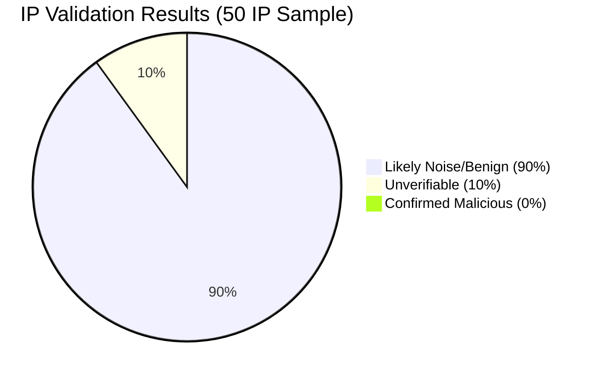
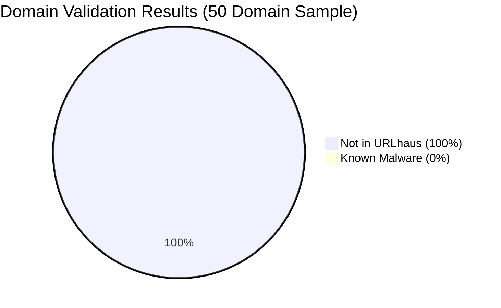
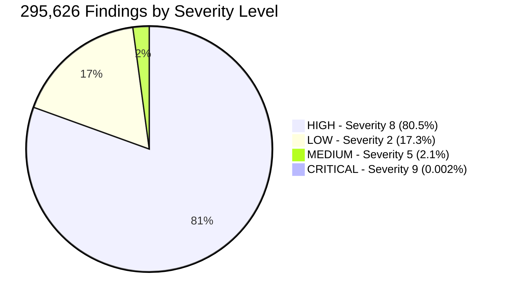
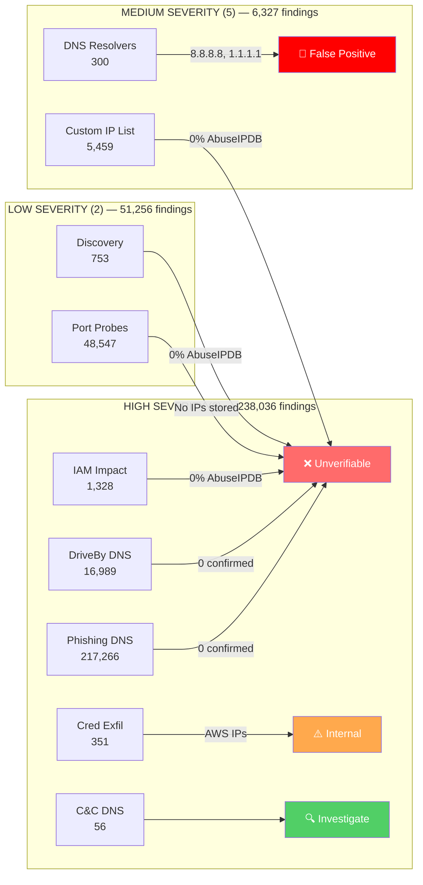
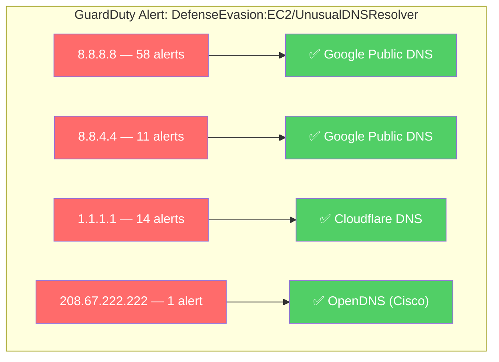
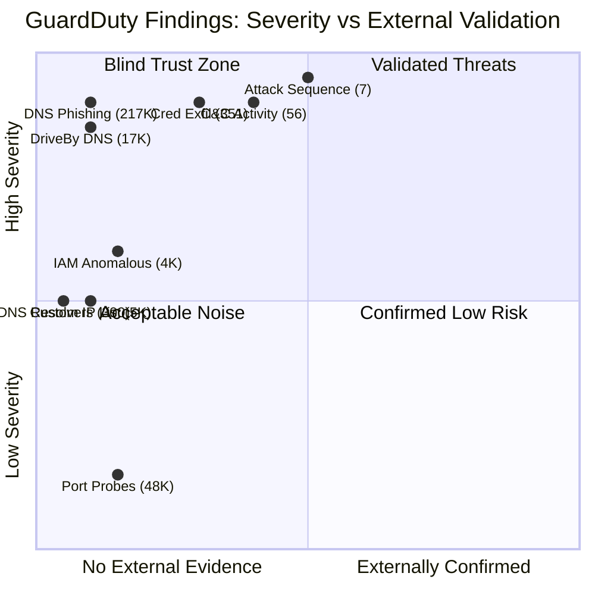
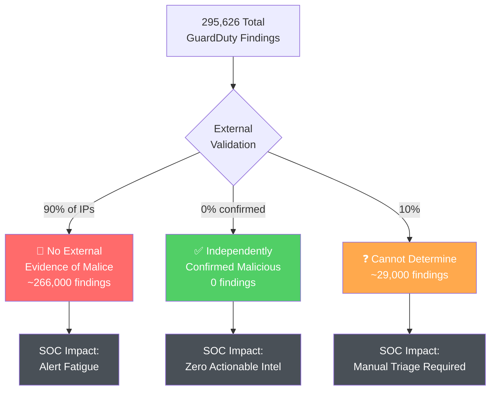
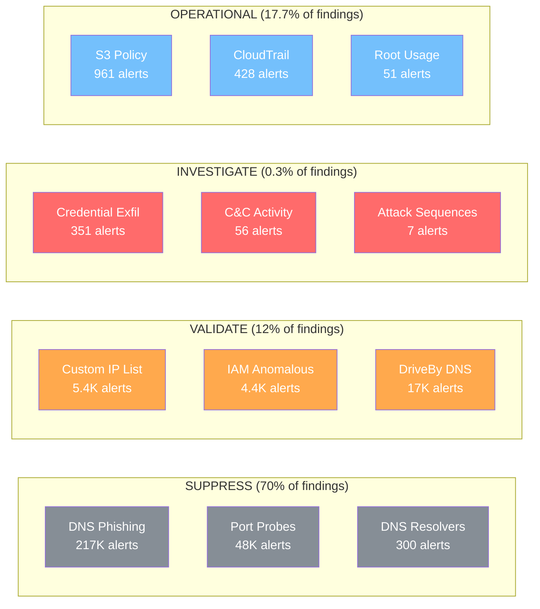

# 📊 GuardDuty Threat Intelligence Validation — Visual Report

> **Report Date:** 2026-07-10  
> **Scope:** 295,626 findings | 724 public IPs | 40,908 domains  
> **Validated Against:** GreyNoise, AbuseIPDB, URLhaus

---

## 🎯 Validation Results at a Glance





---

## 📈 Findings by Severity



---

## 🏗️ Finding Types — Volume vs Validation



---

## 🚨 Noise Breakdown: What GuardDuty Flags vs Reality



---

## 📊 Top Finding Types by Volume

| # | Finding Type | Severity | Count | Bar |
|---|---|:---:|---:|---|
| 1 | Trojan:EC2/PhishingDomainRequest!DNS | 🔴 8 | 217,266 |  |
| 2 | Recon:EC2/PortProbeUnprotectedPort | 🟡 2 | 48,547 |  |
| 3 | Trojan:EC2/DriveBySourceTraffic!DNS | 🔴 8 | 16,989 |  |
| 4 | UnauthorizedAccess:EC2/MaliciousIPCaller.Custom | 🟠 5 | 2,887 |  |
| 5 | UnauthorizedAccess:IAMUser/MaliciousIPCaller.Custom | 🟠 5 | 1,682 |  |

---

## 🔍 External Intelligence Gap Analysis



---

## 💰 Cost of Noise: Alert Fatigue Impact



---

## 🗂️ Finding Category Heatmap

| MITRE Tactic | Sev 9 | Sev 8 | Sev 5 | Sev 2 | External Validation |
|---|:---:|:---:|:---:|:---:|---|
| **Execution** (DNS Trojan) | | 🟥 234K | | | ❌ None |
| **Reconnaissance** (Probes) | | | 🟧 148 | 🟨 48K | ❌ None |
| **Credential Access** | | 🟥 1.2K | 🟧 32 | | ❌ 0% AbuseIPDB |
| **Exfiltration** | | 🟥 1.2K | | | ❌ 0% AbuseIPDB |
| **Impact** | | 🟥 1.3K | | | ❌ 0% AbuseIPDB |
| **Defense Evasion** | | | 🟧 325 | | 🚨 FALSE POSITIVE |
| **Initial Access** | | | 🟧 61 | | ❌ 0% AbuseIPDB |
| **Lateral Movement** (Cred Exfil) | | 🟥 351 | | | ⚠️ AWS-internal |
| **Persistence** | | | 🟧 24 | | ❌ 0% AbuseIPDB |
| **Privilege Escalation** | | | 🟧 5 | | ❌ 0% AbuseIPDB |
| **Attack Sequence** | 🟪 7 | | | | 🔍 Investigate |

---

## 📋 Actionability Matrix



---

## 🎯 Recommendations Summary

| Priority | Action | Impact | Effort |
|:---:|---|---|---|
| 🔴 P1 | Suppress DNS resolver false positives (8.8.8.8, 1.1.1.1) | -300 alerts | Low |
| 🔴 P1 | Review custom threat list (192.176.1.x, 213.160.156.x) | -5,459 alerts | Medium |
| 🟠 P2 | Integrate AbuseIPDB enrichment in SIEM | Better prioritization | Medium |
| 🟠 P2 | Add URLhaus lookup for DNS findings | Malware attribution | Medium |
| 🟡 P3 | Route S3/CloudTrail findings to compliance (not SOC) | -1,600 alerts from SOC | Low |
| 🟡 P3 | Deploy GreyNoise RIOT for auto-suppression | Reduce benign IP alerts | High |

---

## 📊 Bottom Line

```
┌─────────────────────────────────────────────────────────────────────────────┐
│                                                                             │
│   GuardDuty alone: 295,626 alerts with NO prioritization intelligence       │
│                                                                             │
│   With external TI: <500 alerts worth investigating (~0.17%)                │
│                                                                             │
│   Signal-to-noise ratio: 1:590                                              │
│                                                                             │
│   Conclusion: GuardDuty is a DETECTION engine, not an INTELLIGENCE tool.    │
│               It must be augmented with external threat feeds to be          │
│               operationally useful.                                          │
│                                                                             │
└─────────────────────────────────────────────────────────────────────────────┘
```

---

*Generated by GuardDuty Threat Intel Validator | Data: GreyNoise Community, AbuseIPDB, URLhaus*
